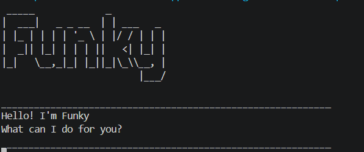

# Funky User Guide


// Product screenshot goes here

// Product intro goes here
Funky is a **desktop chatbot for keeping track of your tasks, optimized for use through a Command Line Interface (CLI)**. You type short commands, and Funky adds, lists, finds, completes and deletes your tasks for you. Your tasks are saved automatically, so they are still there the next time you open Funky.
### Adding a to-do: `todo`

Adds a task that has no date or time.

Format: `todo DESCRIPTION`

Example: `todo read book`

```
____________________________________________________________
Got it. I've added this task:
  [T][ ] read book
Now you have 1 tasks in the list.
____________________________________________________________
```

### Adding a deadline: `deadline`

Adds a task that must be done by a certain date.

Format: `deadline DESCRIPTION /by DATE`

* `DATE` must be written as `yyyy-MM-dd`, for example `2019-10-15`.
* Funky shows the date in a friendlier format, for example `Oct 15 2019`.
* The date must be a real date. For example, `2019-02-30` is rejected.

Example: `deadline return book /by 2019-10-15`

```
____________________________________________________________
Got it. I've added this task:
  [D][ ] return book (by: Oct 15 2019)
Now you have 2 tasks in the list.
____________________________________________________________
```

If the date is not in the right format, Funky tells you how to fix it:

```
____________________________________________________________
Please enter the date as yyyy-MM-dd, e.g. 2019-10-15.
____________________________________________________________
```

### Adding an event: `event`

Adds a task that starts at a certain time and ends at a certain time.

Format: `event DESCRIPTION /from START /to END`

* `START` and `END` can be any text, for example `Mon 2pm` or `6 Dec 4pm`.
* `/from` must come before `/to`.

Example: `event project meeting /from Mon 2pm /to 4pm`

```
____________________________________________________________
Got it. I've added this task:
  [E][ ] project meeting (from: Mon 2pm to: 4pm)
Now you have 3 tasks in the list.
____________________________________________________________
```

### Listing all tasks: `list`

Shows all the tasks in your list, in the order you added them.

Format: `list`

```
____________________________________________________________
Here are the tasks in your list:
1. [T][ ] read book
2. [D][ ] return book (by: Oct 15 2019)
3. [E][ ] project meeting (from: Mon 2pm to: 4pm)
____________________________________________________________
```

Each task line shows its type, its status and its description:

* `[T]`, `[D]` and `[E]` mean to-do, deadline and event.
* `[X]` means the task is done and `[ ]` means it is not done yet.

If you have no tasks, Funky says `Your task list is empty.`

### Marking a task as done: `mark`

Marks the task with the given number as done.

Format: `mark TASK_NUMBER`

* `TASK_NUMBER` must be a number shown by the `list` command.

Example: `mark 2`

```
____________________________________________________________
Nice! I've marked this task as done:
  [D][X] return book (by: Oct 15 2019)
____________________________________________________________
```

### Marking a task as not done: `unmark`

Marks the task with the given number as not done yet.

Format: `unmark TASK_NUMBER`

Example: `unmark 2`

```
____________________________________________________________
OK, I've marked this task as not done yet:
  [D][ ] return book (by: Oct 15 2019)
____________________________________________________________
```

### Deleting a task: `delete`

Removes the task with the given number from your list.

Format: `delete TASK_NUMBER`

* Task numbers of the tasks after it go down by one.

Example: `delete 1`

```
____________________________________________________________
Noted. I've removed this task:
  [T][ ] read book
Now you have 2 tasks in the list.
____________________________________________________________
```

### Finding tasks by keyword: `find`

Finds the tasks whose description contains the keyword.

Format: `find KEYWORD`

* The search is not case-sensitive. For example, `book` matches `Book`.
* The keyword can be part of a word. For example, `book` also matches `notebook`.
* You can search for a phrase. For example, `find read book` matches only descriptions containing `read book`.
* Only the description is searched. Dates and times are not.

Example: `find book`

```
____________________________________________________________
Here are the matching tasks in your list:
1. [T][ ] read book
2. [D][ ] return book (by: Oct 15 2019)
____________________________________________________________
```

If nothing matches, Funky says `No matching tasks found.`

**Note:** the numbers in the search results count from 1 again, so they are *not* task numbers. Use `list` to see the task number before you use `mark`, `unmark` or `delete`.

### Exiting the program: `bye`

Exits Funky.

Format: `bye`

```
____________________________________________________________
Bye. Hope to see you again soon!
____________________________________________________________
```